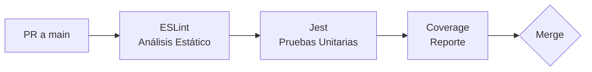

# Bookio - Backend 

[](https://nodejs.org/)
[](https://expressjs.com/)
[](https://www.typescriptlang.org/)
[](https://www.postgresql.org/)
[](https://www.prisma.io/)
[](https://aws.amazon.com/)


Bienvenido al repositorio Backend de **Bookio**.

## 🔗 Ecosistema Bookio
Esta plataforma cuenta con una arquitectura desacoplada. Explora nuestros diferentes repositorios:

* 🌐 [**Frontend (Angular SPA)** ➔ Visitar Repositorio](https://github.com/FPSamu/bookio-frontend)
* 📱 [**Mobile App (Cliente iOS/Android con Flutter)** ➔ Visitar Repositorio](https://github.com/FPSamu/bookio-mobile)
* ⚙️ [**Backend (API REST Node.js)** ➔ Estás aquí](https://github.com/AlanDVarela/bookio-backend)

---

## 📖 Descripción del Proyecto
Actualmente, muchas Pequeñas y Medianas Empresas (PyMEs) del sector servicios (barberías, spas, consultorios) gestionan sus citas de manera manual. Esto ocasiona problemas críticos como el empalme de horarios (*overbooking*), altas tasas de ausentismo (*no-shows*) y pérdida de tiempo productivo en la gestión telefónica.

**Bookio** es una plataforma web SaaS (Software as a Service) multi-negocio diseñada para resolver esta problemática. Su arquitectura en la nube permite alta disponibilidad, garantizando un manejo robusto de concurrencia y aprovechando servicios administrados para tareas asíncronas.

### 👥 Equipo y Distribución de Roles
* **Alan Varela:** Backend feature 1 + Front end.
* **Samuel Pia:** Backend feature 2 + Front end.
* **Jair Aguilar:** Backend feature 3 + CI/CD.

---

## 🏗️ Arquitectura en AWS
El proyecto está diseñado sobre una arquitectura en la nube utilizando los siguientes 5 servicios principales de AWS:

1. **Amazon EC2 (Cómputo):** Alojamiento de nuestra API RESTful (Node.js/Express) bajo entorno Linux.
2. **Amazon RDS - PostgreSQL (Base de Datos):** Implementación del modelo relacional Multi-tenant, garantizando transacciones ACID a través de Prisma ORM.
3. **Amazon S3 (Almacenamiento):** Uso dual para alojamiento del *Static Website* (Frontend SPA) y repositorio para recursos estáticos del negocio (imágenes/logotipos).
4. **Amazon SNS (Mensajería):** Arquitectura orientada a eventos para el envío asíncrono de correos transaccionales (confirmaciones de citas).
5. **AWS Secrets Manager (Seguridad):** Inyección segura de variables de entorno y credenciales hacia nuestras instancias EC2.

### Diagramas Técnicos

<details>
<summary><b>☁️ Ver Diagrama de Arquitectura AWS</b></summary>
<br>
<p align="center">
  
</p>
</details>

<details>
<summary><b>🔀 Ver Flujo de Secuencia (Disponibilidad y Reserva)</b></summary>
<br>
<p align="center">
  
</p>
</details>

<details>
<summary><b>🗄️ Ver Diagrama de Entidad Relación (Multi-tenant)</b></summary>
<br>
<p align="center">
  
</p>
</details>

---

## 🚀 Flujos End-to-End
El desarrollo se centra en 3 flujos principales enumerados:

1. **Flujo 1 - Configuración del Tenant:** Validación y creación del espacio del negocio (Business/Service) almacenando recursos en S3 y RDS.
2. **Flujo 2 - Motor de Reserva:** Manejo de concurrencia relacional estricta para registrar citas sin empalmes en el calendario (PostgreSQL).
3. **Flujo 3 - Notificaciones por Eventos:** Desacoplamiento de procesos mediante la publicación asíncrona de eventos en Amazon SNS para correos de confirmación.

---

## ⚙️ Cómo correr el proyecto (Local)

### Prerrequisitos
* Node.js (v18 o superior)
* PostgreSQL instalado localmente
* Cuenta de AWS (para servicios administrados)

### Pasos de instalación
1. Clona el repositorio:
   ```bash
   git clone https://github.com/AlanDVarela/bookio-backend
   cd bookio-backend
   ```
2. Instala las dependencias:
   ```bash
   npm install
   ```

3. Variables de entorno:
   Crea un archivo `.env` basándote en el archivo `.env.example`. Asegúrate de colocar las llaves correctas de Firebase (`FIREBASE_PRIVATE_KEY`, etc.)

4. Levanta la Base de Datos Local con Docker:
   ```bash
   docker-compose up -d
   ```

5. Sincroniza el esquema de base de datos y llénala de datos base (Seed):
   ```bash
   npx prisma generate
   npx prisma db push
   npx prisma db seed
   ```

6. Inicia el servidor de desarrollo:
   ```bash
   npm run dev
   ```

### 📁 Estructura del Proyecto

```text
bookio-backend/
├── .github/
│   └── workflows/
│       ├── ci.yml               # Pipeline CI (Lint + Tests)
│       └── cd.yml               # Pipeline CD (Build + Deploy)
├── .husky/
│   └── pre-commit               # Hook: lint-staged antes de cada commit
├── docker-compose.yml           # Base de Datos Local
├── .env.example                 # Ejemplo de variables de entorno
├── api.http                     # Archivo de pruebas rápidas REST (VSCode REST Client)
├── eslint.config.mjs            # Configuración de ESLint (TypeScript)
├── jest.config.ts               # Configuración de Jest para pruebas unitarias
├── prisma.config.ts             # Configuración del CLI de Prisma
├── prisma/
│   ├── schema.prisma            # Modelo de Base de Datos
│   └── seed.ts                  # Script para poblar la DB inicial
├── scripts/
│   └── deploy.sh                # Script parametrizado de deploy a EC2
├── tests/
│   └── unit/                    # Pruebas unitarias por módulo
│       ├── appointments/
│       ├── isolation/           # Tests de aislamiento multi-tenant
│       ├── middlewares/
│       ├── schedules/
│       └── services/
└── src/
    ├── app/
    │   ├── appointments/        # Lógica de Reservaciones
    │   ├── auth/                # Rutas y validaciones de Firebase
    │   ├── businesses/          # Puntos de entrada para el local / negocio
    │   ├── favorites/           # Gestión de favoritos del cliente
    │   ├── middlewares/         # Jwt, RequireRole, S3, SNS, SecretManager
    │   ├── reviews/             # Opiniones de citas pasadas
    │   ├── schedules/           # Horarios laborables
    │   ├── services/            # Catálogo de servicios por negocio
    │   └── users/               # Perfil y metadatos de usuario
    ├── config/                  # Inyección de environment (.env)
    ├── database/                # Conexión Adapter Pg de Prisma
    └── index.ts                 # Entry point (Express)
```

---

## 📡 API Reference (`/api/v1`)

A continuación se listan los endpoints principales agrupados por dominio. Todos los endpoints que requieren autenticación esperan un `Bearer Token` de Firebase válido en los headers.

### 🔐 Autenticación (`/auth`)
| Método | Endpoint | Descripción | Body / Query | Headers requeridos |
|---|---|---|---|---|
| POST | `/auth/login` | Login inicial en backend | `{}` | `Auth: Bearer` |
| POST | `/auth/register/client` | Registra a un nuevo usuario como `CLIENT` | `{ name, phone }` | `Auth: Bearer` |
| POST | `/auth/register/business` | Registra a un nuevo usuario como `BUSINESS_OWNER` | `{ name, phone }` | `Auth: Bearer` |
| GET | `/auth/me` | Devuelve el perfil completo del usuario autenticado | N/A | `Auth: Bearer` |

### 🏢 Negocios (`/businesses`)
| Método | Endpoint | Descripción | Body / Query | Headers requeridos |
|---|---|---|---|---|
| GET | `/businesses` | Obtiene el directorio de negocios | `?page, limit` | Público |
| GET | `/businesses/recommended` | Obtiene top 5 de negocios mejor evaluados | N/A | Público |
| GET | `/businesses/:id` | Detalle público del negocio | N/A | Público |
| GET | `/businesses/:id/services` | Lista los servicios ofrecidos por un negocio | N/A | Público |
| GET | `/businesses/metrics` | Obtiene los KPIs de rendimiento del negocio | N/A | `Auth: Bearer` (Owner) |
| GET | `/businesses/reservations` | Obtiene lista de reservas filtrada opcionalmente por fecha | `?date=YYYY-MM-DD` | `Auth: Bearer` (Owner) |

### 📅 Citas (`/appointments`)
| Método | Endpoint | Descripción | Body / Query | Headers requeridos |
|---|---|---|---|---|
| GET | `/appointments` | Obtiene citas. Permite filtrar por estado temporal | `?status=upcoming/past/cancelled` | `Auth: Bearer` |
| GET | `/appointments/slots` | Obtiene slots disponibles para realizar una reserva | `?businessId, date` | Público / Auth |
| POST | `/appointments` | Reserva una nueva cita | `{ businessId, serviceId, startDatetime... }` | `Auth: Bearer` (Client) |
| PUT | `/appointments/:id/status` | Cambia el estado (CONFIRMED/CANCELLED) | `{ status }` | `Auth: Bearer` |

### ⭐ Favoritos & Reseñas (`/favorites`, `/reviews`)
| Método | Endpoint | Descripción | Body / Query | Headers requeridos |
|---|---|---|---|---|
| GET | `/favorites` | Obtiene lista de negocios favoritos del usuario | N/A | `Auth: Bearer` (Client) |
| POST | `/favorites` | Guarda un negocio en favoritos | `{ businessId }` | `Auth: Bearer` (Client) |
| DELETE| `/favorites/:id` | Remueve de favoritos | N/A | `Auth: Bearer` (Client) |
| POST | `/reviews` | Sube una evaluación pos-cita | `{ score, comment, appointment_id }`| `Auth: Bearer` (Client) |
| GET | `/reviews/business/:id` | Obtiene todas las revisiones publicadas de un negocio | N/A | Público |

### 🛠️ Servicios (`/services`)
| Método | Endpoint | Descripción | Body / Query | Headers requeridos |
|---|---|---|---|---|
| GET | `/services` | Obtiene los servicios del negocio del dueño autenticado | N/A | `Auth: Bearer` (Owner) |
| POST | `/services` | Crea un nuevo servicio para el negocio del dueño | `{ name, durationMinutes, price }` | `Auth: Bearer` (Owner) |
| PATCH | `/services/:id/photo` | Sube/actualiza la foto de un servicio (multipart `photo`) | `FormData: photo` | `Auth: Bearer` (Owner) |

### 🗓️ Horarios (`/schedules`)
| Método | Endpoint | Descripción | Body / Query | Headers requeridos |
|---|---|---|---|---|
| POST | `/schedules` | Crea un horario laboral para un negocio | `{ businessId, dayOfWeek, startTime, endTime }` | `Auth: Bearer` (Owner) |

---

## 🛠️ Middlewares Customizados

El proyecto cuenta con un set de middlewares especializados para inyectar lógica de negocio, separar responsabilidades (Separation of Concerns) y mantener los Endpoints limpios:

| Middleware / Servicio | Archivo | Descripción de Responsabilidad |
|---|---|---|
| **Verificador de Firebase** | `auth.middleware.ts: authenticateJWT` | Intercepta el request, lee el header `Authorization`, y con `firebase-admin` valida criptográficamente el token (JWT). Inyecta la data segura decodificada en `req.user`. |
| **Control de Accesos (RBAC)** | `auth.middleware.ts: requireRole` | Actúa junto al verificador. Lee los roles de base de datos extraídos en `req.user` y bloquea u otorga acceso a clientes, dueños de negocios o admins. |
| **Parser Multipart FormData** | `upload.middleware.ts: upload` | Configuración base en memoria (via Multer) para parsear correctamente *uploads* sin ensuciar los controladores. Permite transferencias directas. |
| **AWS S3 Object Uploader** | `s3.service.ts` | Recibe Buffers desde el middleware multipart y mediante el AWS SDK v3 los sube asíncronamente al respectivo Bucket privado/público. Retorna URIs seguras. |
| **AWS SNS Event Dispatcher** | `sns.service.ts` | Servicio global de notificaciones. Emplea Tópicos (Topics) de Amazon Simple Notification Service para disparar triggers a dispositivos móviles o endpoints paralelos de manera no bloqueante. |
| **AWS Secrets Resolver** | `secretManager.service.ts` | Encripta peticiones en runtime que requieren claves API muy sensibles delegando la búsqueda a las bóvedas blindadas de Cloud en lugar de almacenarlas localmente. |

---

## 🧪 Pruebas Unitarias

El proyecto utiliza **Jest** + **ts-jest** para pruebas unitarias. Los tests se organizan en la carpeta `tests/` reflejando la estructura del código fuente:

```text
tests/
└── unit/
    ├── appointments/
    │   └── appointments.service.test.ts
    ├── middlewares/
    │   └── auth.middleware.test.ts
    ├── schedules/
    │   └── schedules.service.test.ts
    └── services/
        ├── services.controller.test.ts
        └── services.service.test.ts
```

### Ejecutar todas las pruebas
```bash
npm test
```

### Ejecutar con cobertura
```bash
npx jest --coverage
```

### Ejecutar un archivo específico
```bash
npx jest tests/unit/services/services.service.test.ts
```

### Estrategia de Testing
- **Mocking completo de Prisma:** Cada suite mockea `prisma` para aislar la lógica de negocio de la base de datos.
- **Mocking de servicios externos:** AWS SNS, Firebase Auth y S3 se mockean para evitar llamadas reales.
- **Cobertura de edge cases:** Tests para errores de BD, validaciones de rol, conflictos de horario (overbooking) y parámetros faltantes.
- **Aislamiento Multi-Tenant:** Tests dedicados que validan que las queries filtran correctamente por `business_id`, asegurando que datos de un negocio nunca se filtren hacia otro.

---

## 🔄 Estrategia de CI/CD

Nuestra estrategia de Integración y Despliegue Continuo se basa en automatizar la calidad del código para evitar que errores humanos lleguen a producción.

### Continuous Integration (CI)

El pipeline de CI se activa automáticamente al realizar un **Pull Request (PR)** hacia la rama `main`:



| Etapa | Herramienta | Descripción |
|---|---|---|
| **Análisis Estático** | ESLint + `typescript-eslint` | Detecta errores de tipado, variables no usadas, `any` explícitos y malas prácticas antes de que lleguen al repo. |
| **Pre-commit Hooks** | Husky + lint-staged | Ejecuta ESLint automáticamente sobre archivos staged en cada commit local, forzando calidad desde el primer push. |
| **Pruebas Unitarias** | Jest + ts-jest | Valida lógica de negocio con mocks de Prisma. Incluye tests de **aislamiento multi-tenant** que comprueban que el filtrado por `business_id` funciona correctamente y no mezcla datos entre tenants en RDS. |
| **Cobertura** | Jest `--coverage` | Genera reporte de cobertura y lo sube como artefacto del pipeline. |

### Continuous Deployment (CD)

Se utilizan **scripts de bash parametrizados** para realizar el despliegue en EC2 mediante SSH:

```bash
# Uso del script de deploy
bash scripts/deploy.sh \
  --host <EC2_IP> \
  --user ec2-user \
  --key ~/.ssh/bookio.pem
```

| Step | Acción |
|---|---|
| 1 | `npm run build` — Compilación TypeScript local |
| 2 | `rsync` — Transferencia de artefactos a EC2 (excluye `node_modules`, `.env`, `tests`) |
| 3 | `npm ci --omit=dev` — Instalación de dependencias de producción en remoto |
| 4 | `npx prisma db push` — Sincronización del esquema de BD |
| 5 | `pm2 restart` — Reinicio de la aplicación sin downtime |

> **Nota:** Actualmente el CD está configurado como *placeholder* (valida build localmente). Cuando la instancia EC2 esté disponible, se activarán los pasos de SSH descomentando la sección correspondiente en `.github/workflows/cd.yml`.

### Archivos del Pipeline

```text
.github/workflows/
├── ci.yml          # Pipeline de CI (Lint + Tests) — trigger: PR a main
└── cd.yml          # Pipeline de CD (Build + Deploy) — trigger: CI exitoso en main

.husky/
└── pre-commit      # Hook: ejecuta lint-staged antes de cada commit

scripts/
└── deploy.sh       # Script parametrizado de despliegue SSH a EC2
```

### Secrets Requeridos (GitHub Actions)

Para activar el CD en producción, configurar estos secrets en el repositorio:

| Secret | Descripción |
|---|---|
| `EC2_HOST` | IP pública o DNS de la instancia EC2 |
| `EC2_USER` | Usuario SSH (e.g. `ec2-user`) |
| `EC2_SSH_KEY` | Contenido de la llave privada PEM |
